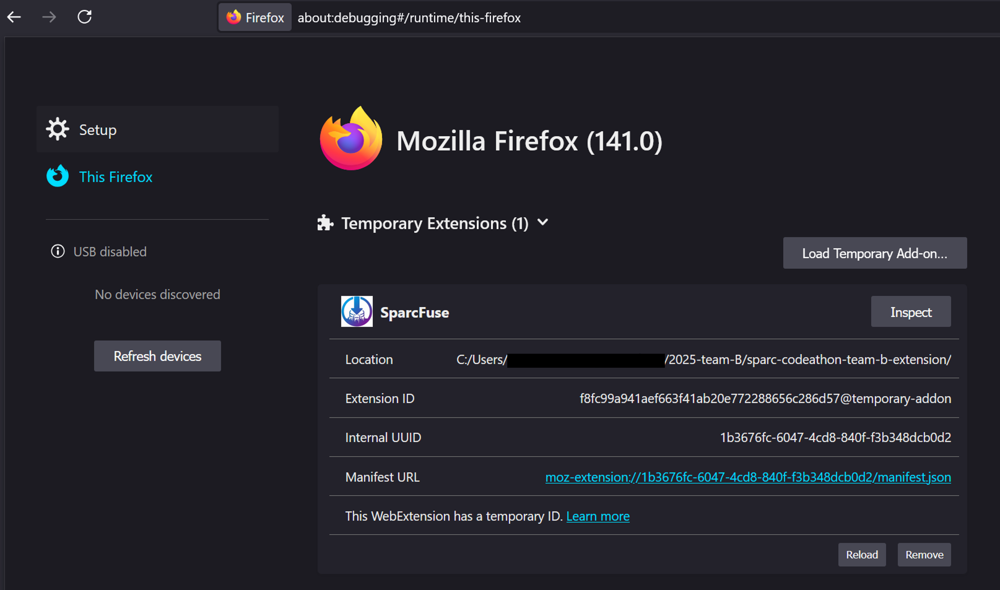
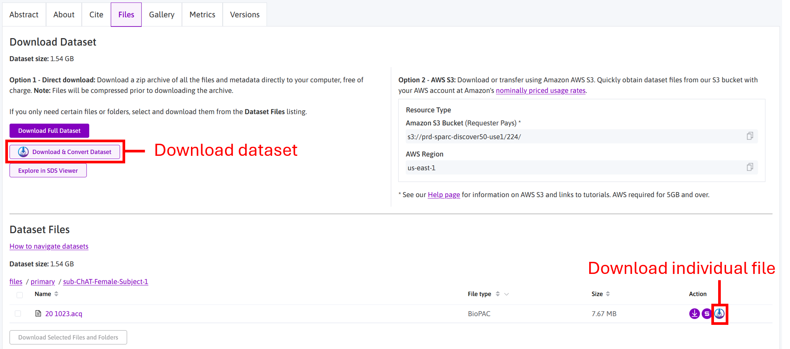

## What is SPARC FUSE?

SPARC FUSE is a file unification and standardization engine for SPARC datasets.

Whether you’re on the command line, in a Python notebook, or on the SPARC Portal itself, FUSE converts the **40+ eclectic imaging & time-series formats** scattered across SPARC datasets into **one clean, cloud-native Zarr layout** (or `.mat` / `.npz`, if you prefer).

✅ **Out of the box, SPARC FUSE supports over 82% of all imaging and time-series file types** found in public SPARC datasets.

* **CLI / Python API** – one call turns raw files into analysis-ready arrays that slot straight into Xarray + Dask, MATLAB, PyTorch, etc.  
* **Browser extension** – adds a “Convert & Download” button to every dataset page so you can grab ready-to-analyze Zarr bundles without leaving your browser.  
* **Cloud-first** – outputs stream directly from S3 for zero-copy workflows that scale from your laptop to HPC or Lambda.

Spend your time on science, not on hunting converters and understanding proprietary internal file structures. 🦾

## Table of Contents

- [Quick start](#quick-start)
  - [Command-line interface](#command-line-interface)
  - [Use as a Python library](#use-as-a-python-library)
    - [0 – Clone the project](#0--clone-the-project)
    - [1 – Convert a single primary file](#1--convert-a-single-primary-file)
    - [2 – Bulk-convert an entire dataset](#2--bulk-convert-an-entire-dataset)
    - [3 – Convert a subset of primary files](#3--convert-a-subset-of-primary-files)
- [Why SPARC FUSE?](#-why-sparc-fuse)
  - [The headache](#the-headache)
  - [The cure](#the-cure)
  - [Why it matters](#why-it-matters)
- [Zarr + AWS: super-charging SPARC data](#-zarr--aws-super-charging-sparc-data)
  - [What is Zarr?](#what-is-zarr)
- [Cloud-first Demo: Prepare & Consume Data from S3](#-cloud-first-demo-prepare--consume-data-from-s3)
  - [What's going on?](#-whats-going-on)
  - [Prepare S3 Bucket](#-prepare-s3-bucket)
  - [Consume Data](#-consume-data)
- [Supported File Formats](#supported-file-formats)
  - [Time-series formats](#time-series-formats)
  - [Imaging formats](#imaging-formats)

---

### 🧬 Full Metadata, Always Included

Every SPARC FUSE export – whether `.zarr`, `.npz`, or `.mat` – **automatically bundles all SPARC metadata** available for the source file or dataset.

In addition, we append detailed **conversion-specific metadata**, including:

```python
meta = {
    "time_units": "seconds",
    "time_auto_generated": True,
    "source_format": "acq",
    "database_id": "1337",
    "sampling_frequency": 1000.0,
    "channel_names": ["CH1", "CH2", "CH3"],
    "channel_units": ["mV", "mV", "mV"],
    "version": "v1.0",
    "upload_date": "2025-07-15T12:34:56Z",
    "conversion_date": "2025-08-03T10:01:22Z",
    "auto_mapped": True,
    "doi": "10.12345/sparc.1337",
    "original_file_name": "20_1021.acq",
    "sparc_subject_id": "sub-ChAT-Male-Subject-1",
    "anatomical_location": "vagus nerve",
    "sweep_mode": False,
    "notes": "Mapped using SPARC FUSE"
}
```
> 💡 This metadata is embedded directly into .zarr attributes or stored as structure / dictionary in .mat / .npz files. Every export is fully self-describing and ready for downstream use or publication.

### 🧠 Smart Mapping with Confidence Scoring

**SPARC FUSE** uses a hybrid mapping system to extract standardized signals, time vectors, metadata, and annotations from a wide range of raw data formats:

- 🔧 Handcrafted descriptors: Expert-written mappings for known formats like .smr, .abf, .adicht, etc.
- 🤖 Heuristic auto-mapping: If no direct match is found, FUSE evaluates all known descriptors using a scoring system and applies the best match.
- 📊 Mapping score: Each descriptor is scored based on required fields (like signals, time, sampling_frequency). The descriptor with the highest score is selected.

# Scoring and fallback logic
```python
result = evaluate_mapping_fields(descriptor, context)
score = score_mapping_result(result, descriptor)
```

>💡 The selected descriptor is recorded in the output metadata, along with auto_mapped = true if it was selected heuristically. This gives you full transparency into how the conversion was performed.

If time is missing in the original file, FUSE will auto-generate a time vector from signal length and set:

```python
"time_auto_generated": true
```

This mapping system ensures that even unknown or partially supported formats can be converted with best-effort accuracy — and that you always know how the output was produced.

---


## 🚀 Quick start

### Command-line interface

```bash
# Clone and install
git clone https://github.com/SPARC-FAIR-Codeathon/2025-team-B.git
cd 2025-team-B/sparcfuse
pip install -e .
cd ..
```

```bash
# Bulk convert primary files of an entire dataset
sparc-fuse 224 --output-dir ./converted
```

https://github.com/user-attachments/assets/f9b51477-b41a-4a96-813b-359fc8919746


```bash
# Convert a file
sparc-fuse 224 primary/sub-ChAT-Male-Subject-1/20_1021.acq --output-dir ./converted
```


https://github.com/user-attachments/assets/1b54a944-55aa-4a29-a013-b7ee97acf08c


```bash
# View options
sparc-fuse --help
```


---

### Use as a Python library

#### Try it out on oSPARC

<p align="center">
<a href="https://osparc.io/#/study/06fbaa3a-6fbc-11f0-bae3-0242ac179953" target="_blank">

</a>
</p>
<br/>


>💡 **Note:** You will have to run the install_sparc_fuse.ipnyb notebook to install all dependencies before working with sparc-fuse

#### Or proceed locally
##### 0 – Clone the project
```python
git clone https://github.com/SPARC-FAIR-Codeathon/2025-team-B.git
cd 2025-team-B
```

##### 1 – Convert a single primary file

```python
from sparc_fuse_core import download_and_convert_sparc_data, list_primary_files

DATASET_ID = 224  # Any valid SPARC dataset ID

files, _ = list_primary_files(DATASET_ID)
print("primary files:", [f["path"] for f in files])

download_and_convert_sparc_data(
    DATASET_ID,
    primary_paths=files[0]["path"].replace("files/", ""),
    output_dir="./output_single",
    file_format="zarr"
)
```


https://github.com/user-attachments/assets/d1361453-c696-4ad8-b893-309cfd2068c4


##### 2 – Bulk-convert an entire dataset

```python
from sparc_fuse_core import download_and_convert_sparc_data, list_primary_files

DATASET_ID = 224  # Any valid SPARC dataset ID

bulk_report = download_and_convert_sparc_data(
    DATASET_ID,
    output_dir="./output_bulk",
    file_format="zarr"
)

from pprint import pprint
pprint(bulk_report)
```


https://github.com/user-attachments/assets/2d56b94f-a4a7-45e5-8e2c-343e355ca5be


##### 3 – Convert a subset of primary files

```python
from sparc_fuse_core import download_and_convert_sparc_data, list_primary_files

DATASET_ID = 224  # Any valid SPARC dataset ID

# Grab (for example) the first three primary files
files, _ = list_primary_files(DATASET_ID)
subset_paths = [f["path"].replace("files/", "") for f in files[:3]]

report = download_and_convert_sparc_data(
    DATASET_ID,
    primary_paths=subset_paths,   # any iterable works
    output_dir="./output_subset",
    file_format="npz",
    overwrite=True                # regenerate if outputs already exist
)

from pprint import pprint
pprint(report)
```


https://github.com/user-attachments/assets/ea2a9a06-2f75-425e-acd9-be26f2c93b7e


> **Tip:** `file_format` accepts `"zarr"`, `"zarr.zip"`, `"npz"`, or `"mat"`. Choose the one that best matches your downstream workflow.

---

# Firefox Plugin

## Start the Server

To start using the Firefox plugin, you must start the local server. This is essential because the plugin relies on the backend to process and serve data.
The Firefox plugin communicates with your local server for data conversion and download, so the server must be running for the extension to function.

In your terminal navigate to the server directory and start the server with:

```bash
cd 2025-team-B/server
python server.py
```

The server will run locally at: http://127.0.0.1:5000 (port 5000).

## Install the Firefox plugin
Open your Firefox browser and navigate to about:debugging#/runtime/this-firefox.

Click Load Temporary Add-on and select the manifest.json file from the plugin directory.

The extension will appear in your browser extensions area.

<p align="center">
  
</p>

## Using the Plugin to Download Data from the SPARC Website

Once the Firefox plugin is installed and the server is running, you can use it to download datasets directly from the [SPARC website](https://sparc.science).

The plugin integrates into the SPARC website interface and provides two types of download options:

1. **Download the Full Dataset**  
   Use the **Download & Convert Dataset** button to retrieve the entire dataset. This button is located near the top of the dataset page.

2. **Download Individual Files**  
   For selective downloading, each file listed in the dataset has its own **Download & Convert** icon. Clicking this button lets you fetch only the specific file you need.

<p align="center">
  
</p>

> The plugin processes and converts the files through your local server before saving them to your machine. Make sure the server is active while downloading.


## ❓ Why SPARC FUSE?

### The headache  
* SPARC hosts **40 + heterogeneous file formats** and **countless sub-variants** (custom internal structures) – each with its own quirks.  
* Researchers lose precious hours hunting converters and writing glue code instead of analysing data.  
* This format jungle breaks reproducibility and puts **FAIR principles at risk**.


<p align="center">

 <br/>
  <sub><em><strong>Figure&nbsp;1.</strong></em> Relative frequency of every time series and imaging file extension found in public SPARC datasets (log-scaled word cloud).</sub>
</p>

<p align="center">
  
  <br/>
<sub><em><strong>Figure&nbsp;2.</strong></em>The SPARC database contains <strong>20 + distinct time-series formats</strong> and <strong>20 + imaging formats</strong>, each hiding additional proprietary structures inside the files.</sub></p>

### The cure  
* **SPARC FUSE** automatically remaps *any* supported file (time-series & imaging) into a **uniform, chunked Zarr store**<br>
  – optionally also `.mat`, or `.npz`, for legacy tools.

✅ Currently, out of the box, **SPARC FUSE supports over 82% of all imaging and time-series file types** found in public SPARC datasets.
  
<p align="center">
  
</p>

* Works three ways:  
  1. **Python API** – bulk-convert or cherry-pick files in a single call.  
  2. **CLI** – one-liner on the command line.  
  3. **Browser button** – “Convert & Download” directly from the SPARC portal.  
* Keeps full provenance: every conversion is logged, making pipelines **fully reproducible**.

### Why it matters  
* ✅ **Hours → seconds:** spend time on science, not format wrangling.  
* 🔄 **Interoperability out-of-the-box:** unified layout means the same loader works for every dataset.  
* ☁️ **Cloud-ready chunks:** Zarr’s design unlocks scalable, parallel analysis on HPC or S3-style storage.  
* 🌐 **FAIR boost:** data become immediately *Accessible*, *Interoperable* and *Reusable* across toolchains.


### Supported File Formats


 <p align="center">
  <b>SPARC FUSE: One data format to unite them all</b>
  <br/>
 </p>
 
---
## 🌩️ Zarr + AWS: super-charging SPARC data


> **TL;DR** — Zarr is a cloud-native chunked-array format that lets you *stream* only the bytes you need.  
> SPARC datasets are now mirrored on **Amazon S3 via the AWS Registry of Open Data**, so Zarr fits like a glove.

| Why Zarr? | Why now? |
|-----------|----------|
| *“Zarr is like Parquet for arrays.”* It stores N-D data in tiny, independent chunks—perfect for parallel reads/writes and lazy loading. | SPARC just announced that **all public datasets are directly accessible on AWS S3** (Requester Pays) and even have a listing on the AWS Open Data Registry.|
| Plays nicely with `xarray`, Dask, PyTorch, TensorFlow, MATLAB (via `zarr-matlab`), and more. | With data already in S3, a converted Zarr store can be queried **in-place** from an EC2, Lambda, or SageMaker job—no re-download cycles. |
| Open spec, community-driven, language-agnostic. | SPARC FUSE’s one-line `sparc-fuse <id> … --file-format zarr` command gives you an **analysis-ready** cloud-optimised dataset in seconds. |

### What is Zarr?

<p align="center">
  <br/>
<sub><em><strong>Figure&nbsp;3.</strong> Zarr Overview.</em> Diagram adapted from the Earthmover blog post <a href="https://earthmover.io/blog/what-is-zarr">“What is Zarr?”</a>.</sub>
</p>

* **Chunked storage** – data are broken into independently readable/writable tiles.  
* **Cloud-optimised layout** – each chunk is just an object in S3 / GCS, so you stream only the bytes you need.  
* **Parallel-ready** – Dask, Ray, Spark, etc. slurp different chunks concurrently for massive speed-ups.  
* **Open spec** – language-agnostic, community-governed, and already adopted by NASA, OME-Zarr, Pangeo, and more.

## ☁️ Cloud-first Demo: Prepare & Consume Data from S3

This demo illustrates a simple, end-to-end workflow for cloud-based data handling:  
Convert SPARC primary files into Zarr format, upload them to S3, consolidate metadata, and open them directly in Xarray without downloading the entire dataset. You stream only the slices you need, making your analysis quicker and easier.

### 🚀 What's going on?
- Convert a SPARC primary file to Zarr.
- Upload the converted data to an S3 bucket.
- Consolidate metadata for fast remote access.
- Wrap into an Xarray-compatible Zarr store, ready to use with `xr.open_zarr(...)`.
- Lazily open and stream data slices directly from S3.

### 🛠️ Prepare S3 Bucket

```python
from sparc_fuse_core import (
    list_primary_files, download_and_convert_sparc_data,
    upload_to_s3, consolidate_s3_metadata,
    create_xarray_zarr_from_raw, generate_and_upload_manifest
)

# Parameters
DATASET_ID = 224
BUCKET = "sparc-fuse-demo-ab-2025"
REGION = "eu-north-1"
RAW_ZARR = "20_1021_std.zarr"
XARRAY_ZARR = "20_1021_std_xarray.zarr"

# Convert SPARC file to Zarr locally
files, _ = list_primary_files(DATASET_ID)
primary_path = files[0]["path"].replace("files/", "")
download_and_convert_sparc_data(
    DATASET_ID,
    primary_paths=primary_path,
    output_dir="./output_single",
    file_format="zarr"
)

# Upload raw Zarr to S3
upload_to_s3(f"./output_single/{RAW_ZARR}", BUCKET, RAW_ZARR, REGION)

# Consolidate metadata
consolidate_s3_metadata(BUCKET, RAW_ZARR, REGION)

# Create Xarray-compatible Zarr and upload to S3
create_xarray_zarr_from_raw(BUCKET, RAW_ZARR, XARRAY_ZARR, REGION)

# Generate discovery manifest and upload
generate_and_upload_manifest(DATASET_ID, BUCKET, XARRAY_ZARR, REGION)

print("✅ Preparation complete.")
```


https://github.com/user-attachments/assets/ecb7dc76-03ea-4f5c-8f20-4ffb3451bbc9


### 📋 Consume Data

#### Load 100,000 time points and plot

```python
from sparc_fuse_core import open_zarr_from_s3
import time
import matplotlib.pyplot as plt

# Open dataset lazily from S3
ds = open_zarr_from_s3(bucket="sparc-fuse-demo-ab-2025", zarr_path="20_1021_std_xarray.zarr")
print(ds)  # Immediately available metadata, lazy data loading

# Example: load a subset of channel 1 for the first 100,000 time points
start = time.perf_counter()
subset_ch1 = ds["signals"].sel(channel=1).isel(time=slice(0, 100000)).load()
elapsed = time.perf_counter() - start

# plot
plt.figure(figsize=(6, 1.5)), plt.plot(subset_ch1.time.values, subset_ch1.values)
plt.xlabel("Time"), plt.ylabel("CH1"), plt.tight_layout(), plt.show()
print(f"Subset load time: {elapsed:.3f} s")
```

https://github.com/user-attachments/assets/3bf3f012-238a-4456-9a0a-5c84867368d5

> ⏳ Took only **0.3 s** to load the **100,000 time points** from s3.

#### Get SPARC Metadata from zarr

```python
z = open_zarr_from_s3(BUCKET, XARRAY_ZARR, region="eu-north-1")
metadata = dict(z.attrs)
print(json.dumps(metadata['sparc_metadata'], indent=2))
```


https://github.com/user-attachments/assets/c82d8ee8-387e-4bda-bf96-e3b8642fc191


### ⏱ s3 slice speedup vs SPARC download & slice

s3 slice is roughly **33× faster** than doing a fresh SPARC download and slice for the same data slice.

<p align="center">

<br/>
        <sub><em><strong>Figure&nbsp;7.</strong> </em> Latency comparison for SPARC download & slice (~9.8s) vs s3 slice (~0.3s), showing ~33× speedup.</sub>
</p>

---

## Supported File Formats

### Format Support Legend
- 🟢 Fully supported and tested
- 🟡 Expected to work via auto-mapping or heuristic parsing
- 🔴 Not yet supported

### Time-Series Formats

| Extension(s)  | Description                                                   | Support Status |
|------------|---------------------------------------------------------------|----------------|
| `.mat`     | MathWorks MATLAB file                                         | 🟢             |
| `.smr`     | CED Spike2 binary recording                                   | 🟢             |
| `.csv`     | Comma-separated values text (generic)                         | 🟢             |
| `.adicht`  | ADInstruments LabChart binary trace                           | 🟢             |
| `.hdf5`    | Hierarchical Data Format v5 container                         | 🟢             |
| `.h5`      | Same as `.hdf5`                                               | 🟢             |
| `.abf`     | Molecular Devices Axon Binary File (pClamp)                   | 🟢             |
| `.rhd`     | Intan RHD2000 amplifier data                                  | 🟢             |
| `.nev`     | Blackrock NeuroPort event file                                | 🔴             |
| `.ns5`     | Blackrock continuous 30 kHz signal                             | 🟢             |
| `.ns2`     | Blackrock 1 kHz LFP signal                                     | 🔴             |
| `.ns1`     | Blackrock low-rate summary signal                             | 🔴             |
| `.smrx`    | CED Spike2 v9+ extended recording                             | 🟢             |
| `.wav`     | Waveform audio (PCM)                                          | 🟢             |
| `.acq`     | AxoScope raw acquisition                                      | 🟢             |
| `.tdx`, `.tev`, `.tnt`, `.tsq`    | TDT Synapse time-series (multi-file)   | 🔴             |
| `.eeg`, `.vmrk`, `.vhdr`     | BrainVision EEG dataset (multi-file)        | 🔴             |
| `.sev`     | TDT RS4 single-channel stream                                 | 🔴             |

### Imaging Formats

| Extension(s) | Description                                                    | Support Status |
|-----------|----------------------------------------------------------------|----------------|
| `.tif`    | Tagged Image File Format (high-bit-depth microscopy)           | 🟢             |
| `.tiff`   | Same as `.tif`                                                 | 🟢             |
| `.czi`    | Carl Zeiss ZEN container                                       | 🟢             |
| `.nd2`    | Nikon NIS-Elements microscope image                            | 🟢             |
| `.lsm`    | Zeiss laser-scanning-microscope stack                          | 🔴             |
| `.jpx`    | JPEG-2000 (JPX) image                                          | 🟡             |
| `.svs`    | Aperio/Leica whole-slide image                                 | 🔴             |
| `.ims`    | Bitplane Imaris 3-D/4-D scene                                  | 🟢             |
| `.png`    | Portable Network Graphics (lossless)                           | 🟡             |
| `.jpg`    | JPEG compressed image                                          | 🟢             |
| `.jpeg`   | Same as `.jpg`                                                 | 🟡             |
| `.bmp`    | Windows bitmap                                                 | 🟡             |
| `.vsi`    | Olympus virtual-slide “wrapper” file                           | 🟡             |
| `.ets`    | Olympus VS series full-resolution tile set                     | 🟡             |
| `.jp2`    | JPEG-2000 codestream                                           | 🟡             |
| `.roi`    | ImageJ/Fiji region-of-interest set                             | 🟡             |
| `.dm3`    | Gatan DigitalMicrograph EM image                               | 🟡             |
| `.pxp`    | Igor Pro packed experiment (can embed images)                  | 🟡             |
| `.ipf`    | Igor Pro procedure/data file                                   | 🟡             |
| `.lif`    | Leica Image File (LAS X)                                       | 🟡             |
| `.ima`    | Amira/Avizo volumetric raw image                               | 🟡             |
| `.mrxs`   | 3DHISTECH Mirax whole-slide image                              | 🟡             |
| `.obj`    | Wavefront 3-D mesh                                             | 🟡             |
| `.avi`    | Uncompressed/codec AVI video (time-lapse stacks)              | 🟡             |
| `.exf`    | Zeiss experiment file (ZEN)                                    | 🟡             |
| `.cxd`    | Olympus cellSens dataset                                       | 🟡             |


---

## Tested Single File and Bulk Conversion

| Dataset ID | Type        | Source Format(s)                 | Success |
|------------|-------------|----------------------------------|---------|
| [108](https://sparc.science/datasets/108) | Time Series | `.csv`                           | ✅      |
| [126](https://sparc.science/datasets/126) | Time Series | `.acq`                           | ✅      |
| [142](https://sparc.science/datasets/142) | Time Series | `.csv`                           | ✅      |
| [148](https://sparc.science/datasets/148) | Time Series | `.acq`                           | ✅      |
| [149](https://sparc.science/datasets/149) | Time Series | `.smr`                           | ✅      |
| [150](https://sparc.science/datasets/150) | Time Series | `.smr`                           | ✅      |
| [224](https://sparc.science/datasets/224) | Time Series | `.acq`                           | ✅      |
| [297](https://sparc.science/datasets/297) | Time Series | `.abf`                           | ✅      |
| [301](https://sparc.science/datasets/301) | Time Series | `.csv`                           | ✅      |
| [305](https://sparc.science/datasets/305) | Time Series | `.csv`                           | ✅      |
| [309](https://sparc.science/datasets/309) | Time Series | `.mat`                           | ✅      |
| [310](https://sparc.science/datasets/310) | Time Series | `.mat`                           | ✅      |
| [315](https://sparc.science/datasets/315) | Time Series | `.smrx`                          | ✅      |
| [316](https://sparc.science/datasets/316) | Time Series | `.rhd`                           | ✅      |
| [323](https://sparc.science/datasets/323) | Time Series | `.csv`                           | ✅      |
| [327](https://sparc.science/datasets/327) | Time Series | `.mat`                           | ✅      |
| [338](https://sparc.science/datasets/338) | Time Series | `.smrx`                          | ✅      |
| [349](https://sparc.science/datasets/349) | Time Series | `.hdf5`                          | ✅      |
| [350](https://sparc.science/datasets/350) | Time Series | `.csv`                           | ✅      |
| [351](https://sparc.science/datasets/351) | Time Series | `.csv`                           | ✅      |
| [357](https://sparc.science/datasets/357) | Time Series | `.mat`                           | ✅      |
| [375](https://sparc.science/datasets/375) | Time Series | `.mat`                           | ✅      |
| [376](https://sparc.science/datasets/376) | Time Series | `.mat`                           | ✅      |
| [378](https://sparc.science/datasets/378) | Time Series | `.adicht`, `.adidat`, `.adidatx` | ✅      |
| [380](https://sparc.science/datasets/380) | Time Series | `.hdf5`                          | ✅      |
| [391](https://sparc.science/datasets/391) | Time Series | `.hdf5`                          | ✅      |
| [400](https://sparc.science/datasets/400) | Time Series | `.adi`, `.mat`                   | ✅      |
| [406](https://sparc.science/datasets/406) | Time Series | `.dat`, `.wav`                   | ✅      |
| [425](https://sparc.science/datasets/425) | Time Series | `.csv`                           | ✅      |
| [435](https://sparc.science/datasets/435) | Time Series | `.abf`                           | ✅      |
| [436](https://sparc.science/datasets/436) | Time Series | `.ns5`                           | ✅      |
| [117](https://sparc.science/datasets/117) | Imaging     | `.rhd`                           | ✅      |
| [65](https://sparc.science/datasets/65)   | Imaging     | `.nd2`, `.tif`                   | ✅      |
| [132](https://sparc.science/datasets/132) | Imaging     | `.ima`                           | ✅      |
| [187](https://sparc.science/datasets/187) | Imaging     | `.jpg`                           | ✅      |
| [290](https://sparc.science/datasets/290) | Imaging     | `.tif`                           | ✅      |
| [296](https://sparc.science/datasets/296) | Imaging     | `.ims`                           | ✅      |


---

## CRediT
**Max Haberbusch:** Conceptualization, Data curation, Formal Analysis, Investigation, Methodology, Software, Supervision, Validation, Visualization, Writing – original draft, Writing – review & editing; **David Lung:** Data curation, Formal Analysis, Investigation, Methodology, Software, Validation, Visualization, Writing – review & editing; **Philipp Heute:** Investigation, Software, Validation, Visualization, Writing – original draft, Writing – review & editing; **Sebastian Hochreiter:** Investigation, Software, Validation, Writing – review & editing; **Laurenz Berger:** Validation, Writing – review & editing
