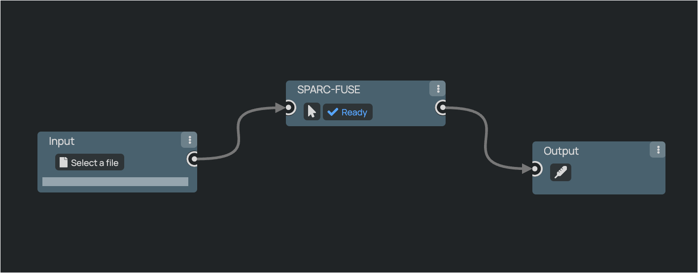
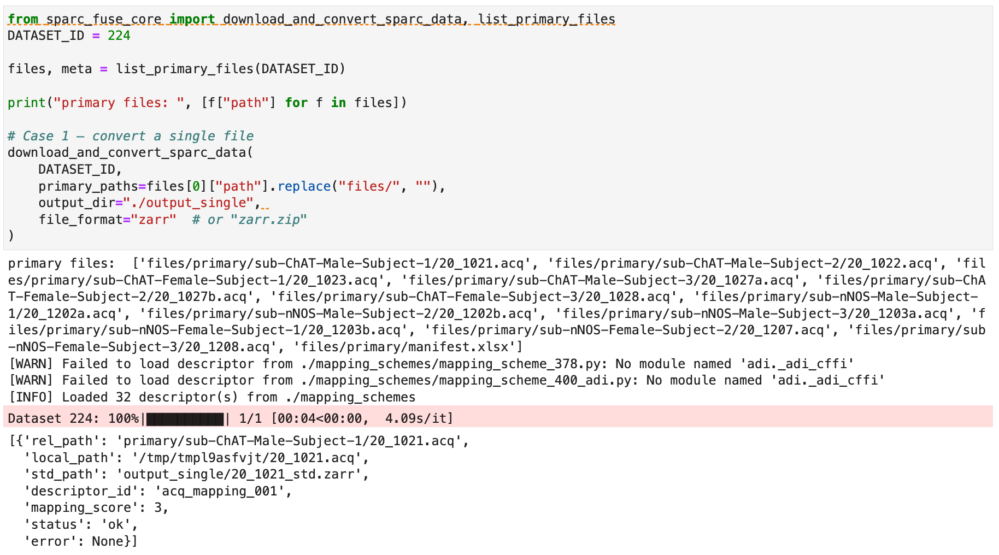
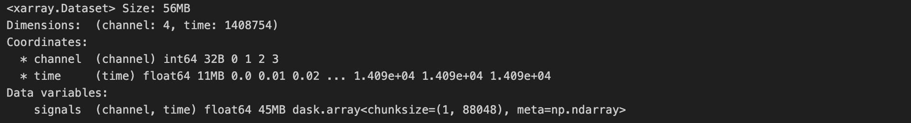
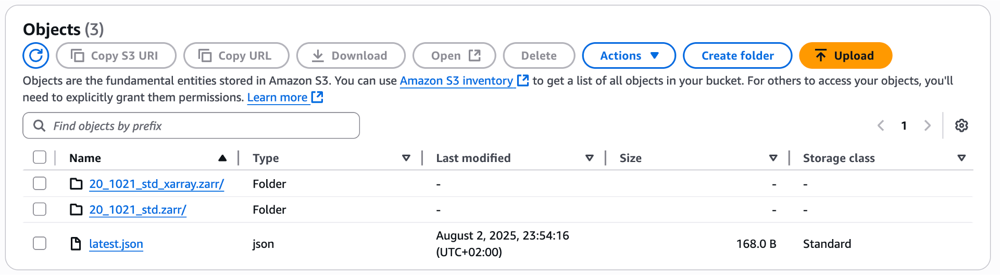
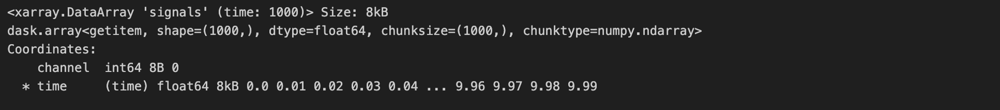
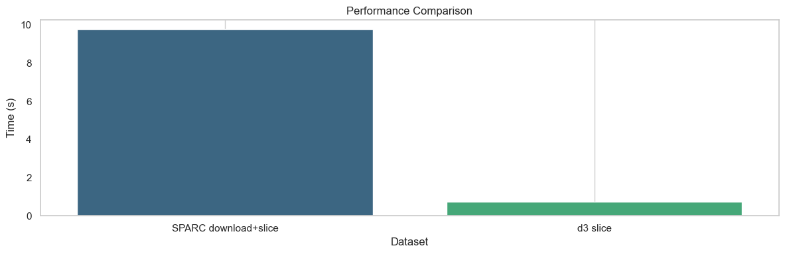

# SPARC FUSE


**SPARC FUSE** is an open-source “format fuse box” for the NIH SPARC ecosystem.  

Whether you’re on the command line, in a Python notebook or on the SPARC Portal itself, FUSE converts the **40 + eclectic imaging & time-series formats** scattered across SPARC datasets into **one clean, cloud-native Zarr layout** (or `.mat` / `.npz`, if you prefer).  

* **CLI / Python API** – one call turns raw files into analysis-ready arrays that slot straight into Xarray + Dask, MATLAB, PyTorch, etc.  
* **Browser extension** – adds a “Convert & Download” button to every dataset page so you can grab ready-to-analyze Zarr bundles without leaving your browser.  
* **Cloud-first** – outputs stream directly from S3 (via the AWS Registry of Open Data) for zero-copy workflows that scale from your laptop to HPC or Lambda.

Spend your time on science, not on hunting converters and understanding proprietary internal file structures. 🦾

## 🚀 Quick start

### Command-line interface

```bash
# Clone and install
git clone https://github.com/SPARC-FAIR-Codeathon/2025-team-B.git
cd 2025-team-B/sparcfuse
pip install -e .
cd ..
```

```bash
# Convert a file
sparc-fuse 224 primary/sub-ChAT-Male-Subject-1/20_1021.acq --output-dir ./converted
```

```bash
# View options
sparc-fuse --help
```


---

### Use as a Python library

#### Try it out on oSPARC
<a href="https://osparc.io/#/study/06fbaa3a-6fbc-11f0-bae3-0242ac179953" target="_blank"></a>

<!---->

#### Or proceed locally
##### 0 – Clone the project
```python
git clone https://github.com/SPARC-FAIR-Codeathon/2025-team-B.git
cd 2025-team-B
```

##### 1 – Convert a single primary file

```python
from sparc_fuse_core import download_and_convert_sparc_data, list_primary_files

DATASET_ID = 224  # Any valid SPARC dataset ID

files, _ = list_primary_files(DATASET_ID)
print("primary files:", [f["path"] for f in files])

download_and_convert_sparc_data(
    DATASET_ID,
    primary_paths=files[0]["path"].replace("files/", ""),
    output_dir="./output_single",
    file_format="zarr"
)
```


##### 2 – Bulk-convert an entire dataset

```python
from sparc_fuse_core import download_and_convert_sparc_data, list_primary_files

DATASET_ID = 224  # Any valid SPARC dataset ID

from sparc_fuse_core import download_and_convert_sparc_data, list_primary_files

DATASET_ID = 224  # Any valid SPARC dataset ID

bulk_report = download_and_convert_sparc_data(
    DATASET_ID,
    output_dir="./output_bulk",
    file_format="zarr"
)

from pprint import pprint
pprint(bulk_report)
```


##### 3 – Convert a subset of primary files

```python
from sparc_fuse_core import download_and_convert_sparc_data, list_primary_files

DATASET_ID = 224  # Any valid SPARC dataset ID

# Grab (for example) the first three primary files
files, _ = list_primary_files(DATASET_ID)
subset_paths = [f["path"].replace("files/", "") for f in files[:3]]

report = download_and_convert_sparc_data(
    DATASET_ID,
    primary_paths=subset_paths,   # any iterable works
    output_dir="./output_subset",
    file_format="npz",
    overwrite=True                # regenerate if outputs already exist
)

from pprint import pprint
pprint(report)
```


> **Tip:** `file_format` accepts `"zarr"`, `"zarr.zip"`, `"npz"`, or `"mat"`. Choose the one that best matches your downstream workflow.

## ❓ Why SPARC FUSE?

### The headache  
* SPARC hosts **40 + heterogeneous file formats** and **countless sub-variants** (custom internal structures) – each with its own quirks.  
* Researchers lose precious hours hunting converters and writing glue code instead of analysing data.  
* This format jungle breaks reproducibility and puts **FAIR principles at risk**.
  
<p align="center">
  <br/>
  <sub><em><strong>Figure&nbsp;1.</strong> A pletora of file formats.</em> Relative frequency of every extension found in public SPARC datasets (log-scaled word cloud).</sub>
</p>

<p align="center">
  <br/>
<sub><em><strong>Figure&nbsp;2.</strong></em>The SPARC database contains <strong>20 + distinct time-series formats</strong> and <strong>20 + imaging formats</strong>, each hiding additional proprietary structures inside the files.</sub></p>

### The cure  
* **SPARC FUSE** automatically remaps *any* supported file (time-series & imaging) into a **uniform, chunked Zarr store**<br>
  – optionally also `.mat`, or `.npz`, for legacy tools.
  
<p align="center">
  
</p>

* Works three ways:  
  1. **Python API** – bulk-convert or cherry-pick files in a single call.  
  2. **CLI** – one-liner on the command line.  
  3. **Browser button** – “Convert & Download” directly from the SPARC portal.  
* Keeps full provenance: every conversion is logged, making pipelines **fully reproducible**.

### Why it matters  
* **Hours → seconds:** spend time on science, not format wrangling.  
* **Interoperability out-of-the-box:** unified layout means the same loader works for every dataset.  
* **Cloud-ready chunks:** Zarr’s design unlocks scalable, parallel analysis on HPC or S3-style storage.  
* **FAIR boost:** data become immediately *Accessible*, *Interoperable* and *Reusable* across toolchains.

 <p align="center">
  <b>SPARC-FUSE: One data format to unite them all</b>
  <br/>
 </p>
 
---
## 🌩️ Zarr + AWS: super-charging SPARC data

 <p align="center">
  <br/>
 </p>

> **TL;DR** — Zarr is a cloud-native chunked-array format that lets you *stream* only the bytes you need.  
> SPARC datasets are now mirrored on **Amazon S3 via the AWS Registry of Open Data**, so Zarr fits like a glove.

| Why Zarr? | Why now? |
|-----------|----------|
| *“Zarr is like Parquet for arrays.”* It stores N-D data in tiny, independent chunks—perfect for parallel reads/writes and lazy loading. | SPARC just announced that **all public datasets are directly accessible on AWS S3** (Requester Pays) and even have a listing on the AWS Open Data Registry.|
| Plays nicely with `xarray`, Dask, PyTorch, TensorFlow, MATLAB (via `zarr-matlab`), and more. | With data already in S3, a converted Zarr store can be queried **in-place** from an EC2, Lambda, or SageMaker job—no re-download cycles. |
| Open spec, community-driven, language-agnostic. | SPARC FUSE’s one-line `sparc-fuse <id> … --file-format zarr` command gives you an **analysis-ready** cloud-optimised dataset in seconds. |

### What is Zarr?

<p align="center">
  <br/>
<sub><em><strong>Figure&nbsp;3.</strong> Zarr Overview.</em> Diagram adapted from the Earthmover blog post <a href="https://earthmover.io/blog/what-is-zarr">“What is Zarr?”</a>.</sub>
</p>

* **Chunked storage** – data are broken into independently readable/writable tiles.  
* **Cloud-optimised layout** – each chunk is just an object in S3 / GCS, so you stream only the bytes you need.  
* **Parallel-ready** – Dask, Ray, Spark, etc. slurp different chunks concurrently for massive speed-ups.  
* **Open spec** – language-agnostic, community-governed, and already adopted by NASA, OME-Zarr, Pangeo, and more.

## ☁️ Cloud-first Demo: Prepare & Consume Data from S3

This demo illustrates a simple, end-to-end workflow for cloud-based data handling:  
Convert SPARC primary files into Zarr format, upload them to S3, consolidate metadata, and open them directly in Xarray without downloading the entire dataset. You stream only the slices you need, making your analysis quicker and easier.

### 🚀 What's going on?
- Convert a SPARC primary file to Zarr.
- Upload the converted data to an S3 bucket.
- Consolidate metadata for fast remote access.
- Wrap into an Xarray-compatible Zarr store, ready to use with `xr.open_zarr(...)`.
- Lazily open and stream data slices directly from S3.

### 🛠️ Prepare S3 Bucket

```python
from sparc_fuse_core import (
    list_primary_files, download_and_convert_sparc_data,
    upload_to_s3, consolidate_s3_metadata,
    create_xarray_zarr_from_raw, generate_and_upload_manifest
)

# Parameters
DATASET_ID = 224
BUCKET = "sparc-fuse-demo-ab-2025"
REGION = "eu-north-1"
RAW_ZARR = "20_1021_std.zarr"
XARRAY_ZARR = "20_1021_std_xarray.zarr"

# Convert SPARC file to Zarr locally
files, _ = list_primary_files(DATASET_ID)
primary_path = files[0]["path"].replace("files/", "")
download_and_convert_sparc_data(
    DATASET_ID,
    primary_paths=primary_path,
    output_dir="./output_single",
    file_format="zarr"
)

# Upload raw Zarr to S3
upload_to_s3(f"./output_single/{RAW_ZARR}", BUCKET, RAW_ZARR, REGION)

# Consolidate metadata
consolidate_s3_metadata(BUCKET, RAW_ZARR, REGION)

# Create Xarray-compatible Zarr and upload to S3
create_xarray_zarr_from_raw(BUCKET, RAW_ZARR, XARRAY_ZARR, REGION)

# Generate discovery manifest and upload
generate_and_upload_manifest(DATASET_ID, BUCKET, XARRAY_ZARR, REGION)

print("✅ Preparation complete.")
```

<p align="center">
  
    <sub><em><strong>Figure&nbsp;4.</strong> </em> Xarray dataset loaded directly from S3 (metadata view)</sub>
</p>

<p align="center">
  
    <sub><em><strong>Figure&nbsp;5.</strong> </em> Zarr stores and manifest files available on S3</sub>
</p>

### 📋 Consume Data

```python
from sparc_fuse_core import open_zarr_from_s3

# Open dataset lazily from S3
ds = open_zarr_from_s3(
    bucket="sparc-fuse-demo-ab-2025",
    zarr_path="20_1021_std_xarray.zarr"
)

print(ds)  # Immediately available metadata, lazy data loading

# Stream a specific data slice
subset = ds["signals"].sel(channel=0).isel(time=slice(0, 1000))
print(subset)
```

<p align="center">
  
    <sub><em><strong>Figure&nbsp;6.</strong> </em> Lazy-loaded data slice (first 1000 points of channel 0)</sub>
</p>

### ⏱ d3 slice speedup vs SPARC download+slice

d3 slice is roughly **14× faster** than doing a fresh SPARC download+convert+slice for the same data slice.

<p align="center">
  <br/>
        <sub><em><strong>Figure&nbsp;7.</strong> </em> Median latency comparison for fresh SPARC download+convert+slice and d3 slice.</sub>
</p>


## Supported File Formats


### Time-series formats


| Extension  | Description |
|------------|-------------|
| `.mat`     | MathWorks MATLAB file |
| `.smr`     | CED Spike2 binary recording |
| `.csv`     | Comma-separated values text (generic) |
| `.adicht`  | ADInstruments LabChart binary trace |
| `.hdf5`    | Hierarchical Data Format v5 container |
| `.h5`      | Same as `.hdf5` |
| `.ets`     | TDT electrophysiology time-series block |
| `.abf`     | Molecular Devices Axon Binary File (pClamp) |
| `.rhd`     | Intan RHD2000 amplifier data |
| `.nev`     | Blackrock NeuroPort event file |
| `.ns5`     | Blackrock continuous 30 kHz signal |
| `.ns2`     | Blackrock 1 kHz LFP signal |
| `.ns1`     | Blackrock low-rate summary signal |
| `.smrx`    | CED Spike2 v9+ extended recording |
| `.wav`     | Waveform audio (PCM) |
| `.acq`     | AxoScope raw acquisition |
| `.tbk`     | TDT DataTank “block” metadata |
| `.tdx`     | TDT DataTank index (time-stamp) |
| `.tev`     | TDT event / continuous data stream |
| `.tin`     | TDT Synapse experiment info (zip) |
| `.tnt`     | TDT block annotations |
| `.tsq`     | TDT global time-stamp table |
| `.eeg`     | BrainVision binary signal data |
| `.vmrk`    | BrainVision marker/events |
| `.vhdr`    | BrainVision header |
| `.sev`     | TDT RS4 single-channel stream |
| `.sam`     | Sequence Alignment/Map (SAM) or NREL SAM simulation file |
| `.pss`     | PicoScope oscilloscope settings snapshot |
| `.psmethod`| PalmSens electrochemistry method definition |

---

### Imaging formats

| Extension | Description |
|-----------|-------------|
| `.tif`    | Tagged Image File Format (high-bit-depth microscopy) |
| `.tiff`   | Same as `.tif` |
| `.czi`    | Carl Zeiss ZEN container |
| `.nd2`    | Nikon NIS-Elements microscope image |
| `.lsm`    | Zeiss laser-scanning-microscope stack |
| `.jpx`    | JPEG-2000 (JPX) image |
| `.svs`    | Aperio/Leica whole-slide image |
| `.ims`    | Bitplane Imaris 3-D/4-D scene |
| `.png`    | Portable Network Graphics (lossless) |
| `.jpg`    | JPEG compressed image |
| `.jpeg`   | Same as `.jpg` |
| `.bmp`    | Windows bitmap |
| `.vsi`    | Olympus virtual-slide “wrapper” file |
| `.ets`    | Olympus VS series full-resolution tile set |
| `.jp2`    | JPEG-2000 codestream |
| `.roi`    | ImageJ/Fiji region-of-interest set |
| `.dm3`    | Gatan DigitalMicrograph EM image |
| `.pxp`    | Igor Pro packed experiment (can embed images) |
| `.ipf`    | Igor Pro procedure/data file |
| `.lif`    | Leica Image File (LAS X) |
| `.ima`    | Amira/Avizo volumetric raw image |
| `.mrxs`   | 3DHISTECH Mirax whole-slide image |
| `.obj`    | Wavefront 3-D mesh |
| `.avi`    | Uncompressed/codec AVI video (time-lapse stacks) |
| `.exf`    | Zeiss experiment file (ZEN) |
| `.cxd`    | Olympus cellSens dataset |

